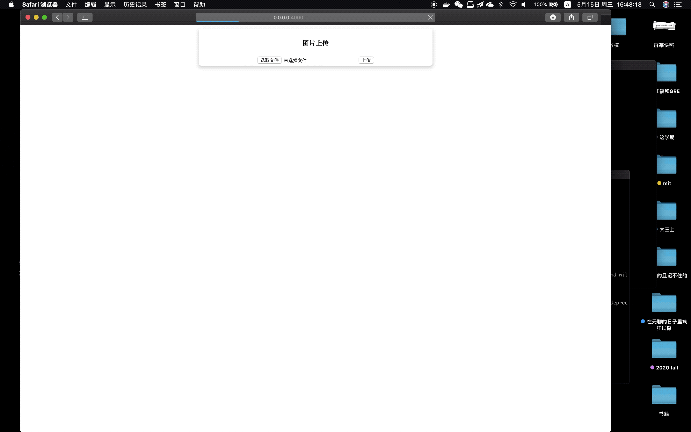

##The Implementation of Deploying the Mnist Application in the Container and Using Cassandra to Store the Data.

##1.What this project will do?
Handwriting recognition has always been a classic topic in deep learning. In order to facilitate people's use, we hope to write an app that allows people to upload pictures on the Web page, and then get predicted numbers of their handwriting. Additionally, the information of upload time, filename and the prediction number can also be recorded in the database at the same time, since the information is conducive to further model checking and data analysis.

##2.demo

##3.requirement
* The knowledge of python is required. (python 3 or more)
* Some simple operations of Cassandra database and Docker containers.

##4. How to run 
* Create a cassandra image from docker. ('aaa' can be changed )

    * $ docker network create some-network
    * $ docker run --name aaa-cassandra --network some-network -p 9042:9042 -d cassandra:latest
    * $ docker run -it --network some-network --rm cassandra cqlsh aaa-cassandra
    

* Put the files: dockerfile, app.py, requirement.txt; the folders: mnist, templates in the same folder.
* Under this folder, create the image.( tag 'mnist16' can be changed )
    * $ docker build –tag=mnist16 .
    * $ docker run -it --network some-network -p 4000:80 mnist16

* Then run on http://0.0.0.0:4000, the user can get the predict number of the upload file. 

##5. Others
* The details can be seen in the report. 
